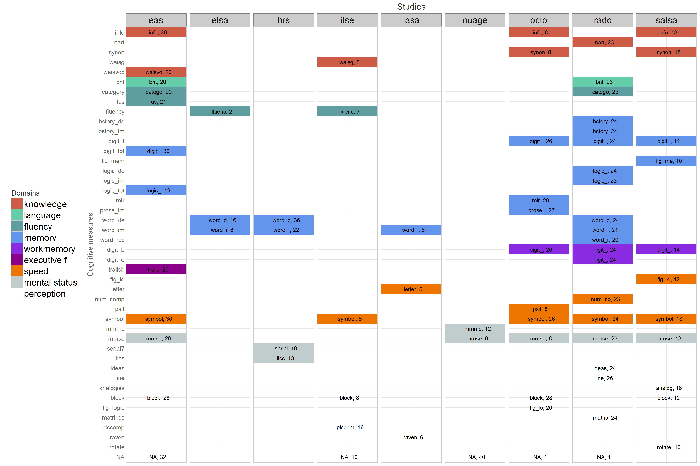

# Cog Domain Map - Portland Workshop


<!--  Set the working directory to the repository's base directory; this assumes the report is nested inside of two directories.-->


<!-- Set the report-wide options, and point to the external code file. -->


<!-- Load the sources.  Suppress the output when loading sources. --> 


<!-- Load 'sourced' R files.  Suppress the output when loading packages. --> 


<!-- Load any Global functions and variables declared in the R file.  Suppress the output. --> 


<!-- Declare any global functions specific to a Rmd output.  Suppress the output. --> 


<!-- Load the datasets.   -->


<!-- Tweak the datasets.   -->


```
List of 1
 $ strip.text.x:List of 10
  ..$ family    : NULL
  ..$ face      : NULL
  ..$ colour    : chr "black"
  ..$ size      : num 7
  ..$ hjust     : NULL
  ..$ vjust     : NULL
  ..$ angle     : num 0
  ..$ lineheight: NULL
  ..$ margin    : NULL
  ..$ debug     : NULL
  ..- attr(*, "class")= chr [1:2] "element_text" "element"
 - attr(*, "class")= chr [1:2] "theme" "gg"
 - attr(*, "complete")= logi FALSE
 - attr(*, "validate")= logi TRUE
```


## Domain Map




The domain map above is the actual data provided by the model in the Portland modeling collective right now. The colors  represent various cognitive domains, as identified by the participants in the model names. The colors categorical.

## Prototype

Andrea Piccinin suggested the followed  structure to investigate replication potential across studies and cognitive domains:
  


## Session Information
For the sake of documentation and reproducibility, the current report was rendered on a system using the following software.


```
Report rendered by koval_000 at 2016-02-29, 09:03 -0800
```

```
R version 3.2.3 (2015-12-10)
Platform: x86_64-w64-mingw32/x64 (64-bit)
Running under: Windows 8.1 x64 (build 9600)

locale:
[1] LC_COLLATE=English_United States.1252  LC_CTYPE=English_United States.1252    LC_MONETARY=English_United States.1252
[4] LC_NUMERIC=C                           LC_TIME=English_United States.1252    

attached base packages:
[1] grid      stats     graphics  grDevices utils     datasets  methods   base     

other attached packages:
[1] lattice_0.20-33 dplyr_0.4.3     ggplot2_2.0.0   shiny_0.13.1    knitr_1.12.3   

loaded via a namespace (and not attached):
 [1] Rcpp_0.12.3      magrittr_1.5     munsell_0.4.3    colorspace_1.2-6 xtable_1.8-2     R6_2.1.2        
 [7] stringr_1.0.0    plyr_1.8.3       tools_3.2.3      parallel_3.2.3   gtable_0.1.2     DBI_0.3.1       
[13] htmltools_0.3    lazyeval_0.1.10  assertthat_0.1   yaml_2.1.13      digest_0.6.9     reshape2_1.4.1  
[19] formatR_1.2.1    evaluate_0.8     mime_0.4         rmarkdown_0.9.5  stringi_1.0-1    scales_0.3.0    
[25] httpuv_1.3.3    
```
